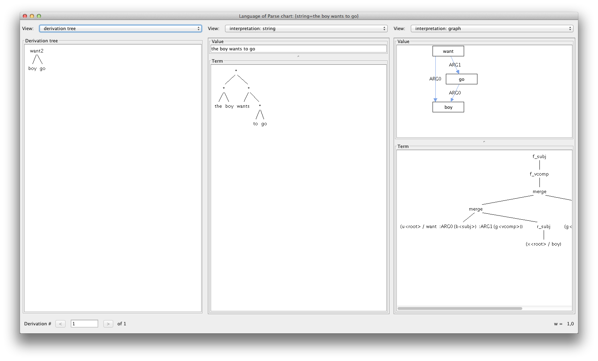

# The Alto parser

Welcome to Alto, the Algebraic Language Toolkit.

Alto is a parser and decoder for Interpreted Regular Tree Grammars (IRTGs). It is being developed at [Saarland University](http://www.coli.uni-saarland.de/) in the Computational Linguistics group, led by [Alexander Koller](http://www.coli.uni-saarland.de/~koller/). Its main features are:

- Represents grammars from a wide variety of popular grammar formalisms as IRTGs, including:
	- Context-free grammars
	- Tree-adjoining grammars (TAG)
	- Tree automata and bottom-up tree transducers
	- Synchronous context-free grammars, TAG, etc.
	- Tree-to-string and string-to-tree transducers
	- Synchronous Hyperedge Replacement Grammars (HRG): Alto is the [fastest published HRG parser in the world](https://www.aclweb.org/anthology/papers/P/P15/P15-1143/)
	- and many more
- Implements chart-based algorithms for
	- parsing
	- synchronous parsing (with inputs from multiple sides of a synchronous grammar)
	- decoding (to another side of a synchronous grammar)
	- computing 1-best (Viterbi) and k-best derivations
	- maximum likelihood and expectation maximization (EM) training
	- binarization
- Supports PCFG-style and log-linear probability models for all of these grammar formalisms.
- Built for easy extensibility: implement your own grammar formalism by adding an [Algebra](https://github.com/coli-saar/alto/wiki/Algebras) class, and use any of the Alto algorithms directly.
- Comes with a GUI that provides access to most of these algorithms and visualizes parsing results.

Alto is published under a [Apache 2.0 license](https://www.apache.org/licenses/LICENSE-2.0). More license information can be found in the file [license-info.md](license-info.md).

The basic theory of IRTGs is explained in [Koller & Kuhlmann, IWPT 2011](https://aclweb.org/anthology/papers/W/W11/W11-2902/). You can find more details on the [Literature](https://github.com/coli-saar/alto/wiki/Literature) page.

# Running and using Alto

Alto requires at least Java 8 and can be downloaded [here](https://github.com/coli-saar/alto/releases).
To build Alto from source, clone this repository and run `./gradlew build` (or `./gradlew.bat build` if you use Windows).

To use Alto as a library in your project, include it via jitpack:
```
repositories {
    [...]
    maven {url 'https://jitpack.io'}
}
dependencies {
    compile group: "com.github.coli-saar", name:"alto", version:"2.3.0"
}
```
If you want to build against the latest version, use `master-SNAPSHOT` or a specific git hash as version.


See the [Wiki](https://github.com/coli-saar/alto/wiki) for more details on how to use Alto. The [tutorials](https://github.com/coli-saar/alto/wiki/Tutorials) are a good way to get started. For advanced usage, you can check out the JavaDoc (see below).

If you run into trouble, please feel free to ask for help on [our Google group](https://groups.google.com/forum/#!forum/alto-users), or you can [submit an issue](https://github.com/coli-saar/alto/issues/).

## JavaDoc ##

You can read the [JavaDoc API documentation for the current stable version](https://javadoc.jitpack.io/com/github/coli-saar/alto/2.3.0/javadoc/) or the [JavaDoc API documentation for the master branch](https://javadoc.jitpack.io/com/github/coli-saar/alto/master-SNAPSHOT/javadoc/).

## Screenshots ##

Here are some screenshots of the Alto GUI. Here's an IRTG with one string and one graph interpretation (equivalent to a synchronous HRG):


Here's the result of parsing "the boy wants to go" with this grammar:




## Version History ##

**Version 2.3.0, April 2019**
- Move to GitHub and switch build system to gradle.
- fix deprecation warnings in the build process
- use more generics instead of raw classes

**Version 2.1, April 2017**

- Improved intersection and invhom algorithms (condensed, sibling-finder) for much faster PCFG, TAG, and HRG parsing (Groschwitz et al., ACL 2016).
- Added pruning techniques, including beam search and coarse-to-fine parsing.
- Added adaptive importance sampler for grammar induction (Teichmann et al., ACL 2016 Workshop on Statistical NLP and Weighted Automata).
- Added "inside" binarization strategy (Klein & Manning 2003).
- Added command-line scripts for parsing and grammar/corpus conversion.
- Initial support for running reproducible experiments using Alto Lab.
- Many small bugfixes and performance improvements.

**Version 2.0, July 2015**

- Initial Bitbucket release.


## Contributors ##

* Danilo Baumgarten (BSc University of Potsdam, 2013)
* Johannes Gontrum (BSc University of Potsdam, 2015)
* [Jonas Groschwitz](http://www.ling.uni-potsdam.de/~groschwitz)
* [Arne Köhn](https://arne.chark.eu)
* [Alexander Koller](http://www.coli.uni-saarland.de/~koller/)
* [Christoph Teichmann](https://www.cteichmann.com/)
